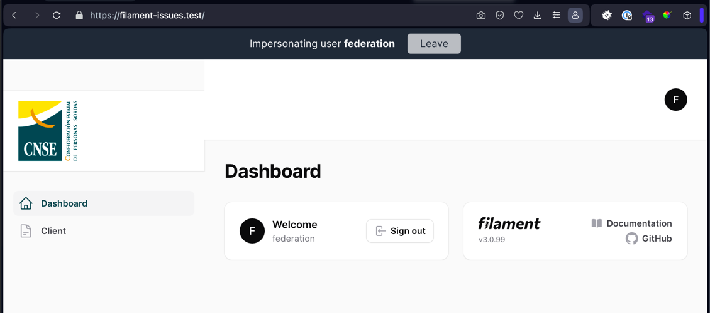

# Filament issues

## Installation
* composer install
* migrate
* seed

Seed will create 3 users (one per role):
* admin@mail.com secret
* federation@mail.com secret
* client@mail.com secret

## Issues

### 1. Problem with footer image and sticky menu
Steps:

* Create custom theme: php artisan make:filament-theme
* Add resources/css/filament/admin/theme.css to vite.config.js
* Add theme to the panel providers: ->viteTheme('resources/css/filament/admin/theme.css')
* Add filament directory to theme/tailwind.config.js:
   './resources/views/vendor/filament-panels/components/*.blade.php',
* Add logo.blade.php to add a custom logo with classes and force top bar height with css
* Add footer.blade.php to add image at the end. 
  * If the panel has the sidebarCollapsibleOnDesktop function, the footer won't stick to the bottom -> **WHY?**

When impersonating (with https://github.com/stechstudio/filament-impersonate), the menu breaks down



Fixed with custom css block 1 in theme.css (but can this be making the next problem)

In the Client resource with multiple tabs and hidden fields that show up depending on the user's selections,
the footer image has a space below and that breaks the top menu.
I'm guessing the issue is related to the hidden or collapsed fields, because the User resource with tabs and multiple fields doesn't behave that way 


### 2. Redirects between 3 panels

We have 3 panels (One per role): 
* admin (path: /admin)
* federation (path: /federation) 
* client (path: /)

But the login has to be the same for all: /login

The Authenticate class will call canAccessPanel after a successful login
To avoid logout of admin or federation in the client's login,
we change the canAccessPanel to return true, and force the redirects in an overwritten LoginResponse.

Also modify the LogoutResponse to redirect to /login

But that means that both admin and federation users will go to the client's panel when going back to the site while being logged in

Where should this redirect be handled? or how to do this in a better way?

### 3. Validation errors load the last tab with errors
I've added to the AppServiceProvider the snippet to show a notification when a validation error happens.
The notification shows the first error, but the form goes to the latest tab with errors. 

It's there a way to make it go to the first one with errors?


### 4. Error in tests

Using Pest, if I try to make a test to check the Logout redirect I get an error 
"ReflectionException: Class "panel" does not exist"

php artisan test --filter=LoginTest

How can I test this POST endpoint?
How should I indicate the panel in the test?

### 5. Translatable fields in selects and indicators

I opened an issue in the filament repo about the labels of translatable fields
This used to work right at the bat in v2, but now forces us to overwrite the label in selects and indicators

Issue -> https://github.com/filamentphp/filament/issues/9292
The repo for this issue is -> https://github.com/buzkall/filament-indicator-translatable-multiple

The issue has a comment written by me after debugging it, I would like to understand why the qualifyColumn function is needed

### 6. Trigger loading while waiting for something in afterStateUpdated

I've copied a macro I'm using in another project, which opens a modal with a select. 
That selection trigger some queries in the afterStateUpdated and populates two hidden fields.
I've simulated it here with a sleep

How can I show a loading indicator while the queries are happening?


### 7. Reorderable gets stuck with 200 items

In v3 goes a little bit faster, but feels unresponsive.
In a project that still is in v2 it reaches the 30 seconds timeout

https://filament-issues.test/admin/videos?isTableReordering=true

### 8. Browser notifications

A project back in v2 needed to have browser notifications. 
I wasn't able to do it in filament. I ended up creating an action to open a black tab where the javascript worked
If I tried to do that inside the resource, the javascript didn't work

```
<script>
    Notification.requestPermission( permission => {
        new Notification('Prueba de notificación');
    });

    window.Echo.private('App.Models.FilamentUser.1')
        .listen('.database-notifications.sent', (event) => {
            console.log(event);

            if (! ('Notification' in window)) {
                alert('Web Notification is not supported');
                return;
            }

            Notification.requestPermission( permission => {
                new Notification('Nuevo mensaje para la web');
            });
        });
</script>
```

### 9. If we're super fast
Having two tabs with the same relationship, breaks the selects with multiple option enabled
